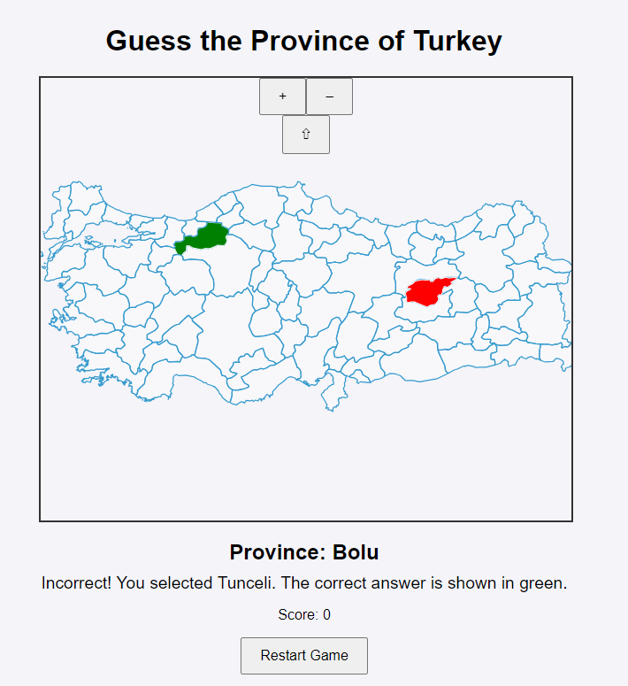

# Guess the Turkish Province

This is an interactive web-based geo-game inspired by Seterra, designed to help players learn and test their knowledge of Turkey's 81 provinces. Players are prompted to identify provinces on the map, with correct guesses highlighted in green and incorrect guesses in red. The game features randomized province selection each round and includes a scoring system. The game is built with HTML, CSS, JavaScript, and OpenLayers for map interaction.

## Features

- **Interactive Map**: Built with OpenLayers to provide a map of Turkey with all provinces.
- **Randomized Province Order**: Each game randomizes the order of provinces to test players' knowledge.
- **Visual Feedback**: 
  - Correct selections are highlighted in green.
  - Incorrect selections show the chosen province in red and the correct answer in green.
- **Scoring and Restart Functionality**: Tracks player’s score and allows the game to restart at any time.

## Screenshots

)

## How to Play

1. The game will display the name of a province for the player to locate on the map.
2. Click on the map to select the province you think matches the displayed name.
   - **If correct**: The selected province will be highlighted in green, and your score will increase.
   - **If incorrect**: The selected province will be highlighted in red, while the correct province will be highlighted in green. The feedback will also indicate the incorrect selection.
3. Proceed to the next question until all provinces are answered.
4. Use the "Restart" button to reset the game and play again.

## More to Come

1. The past performance efforts shown by player and statistics are going to be implemented.
2. A countdown algorithm for game will be constructed.
3. When choice is wrong, the attributes such as knowledge about province would be shown.
